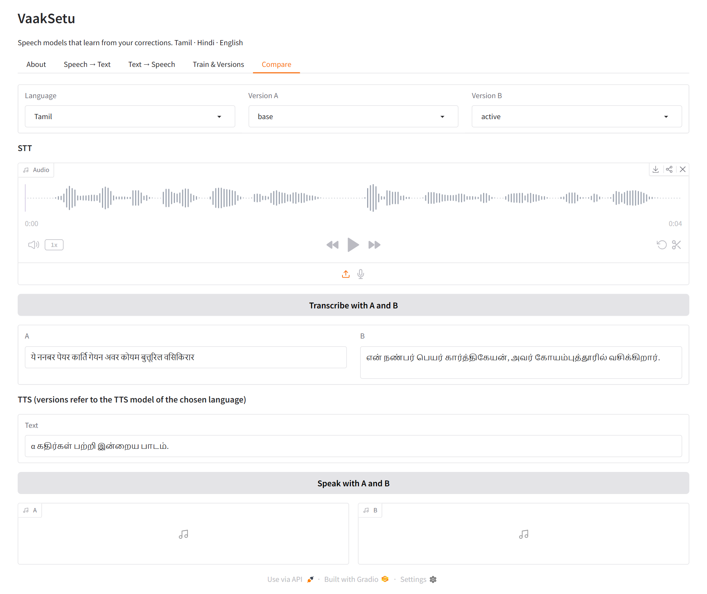
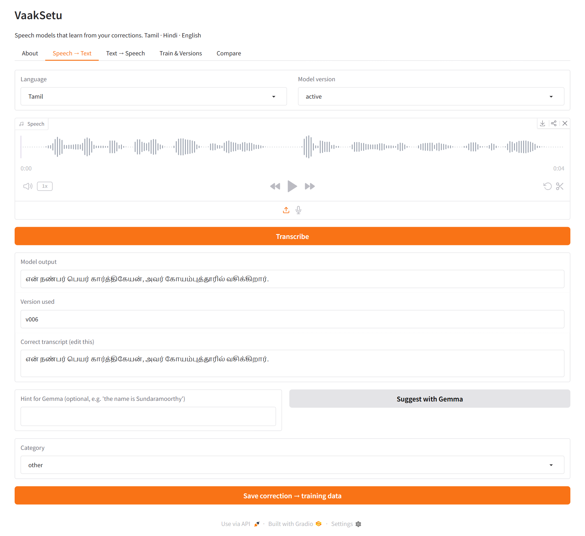
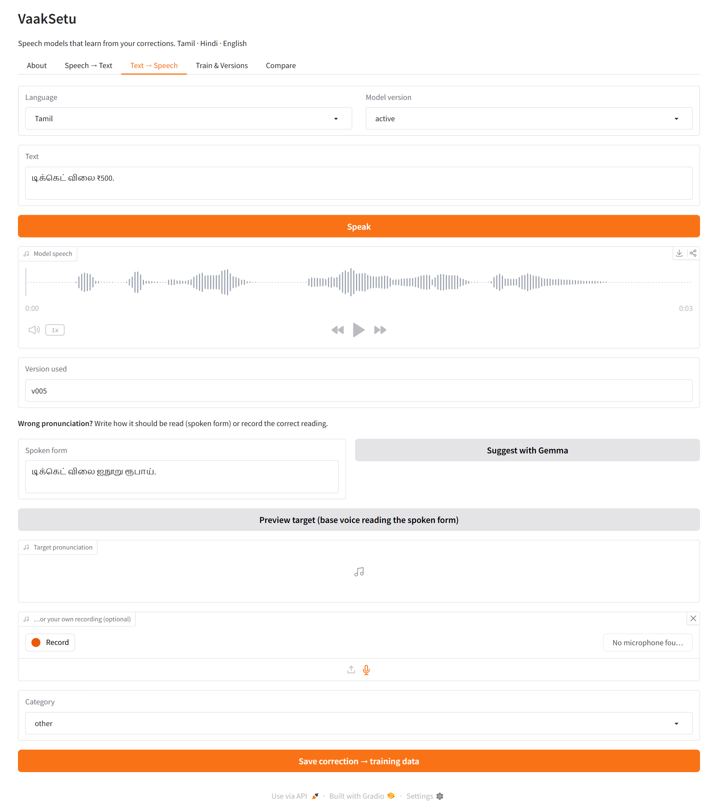
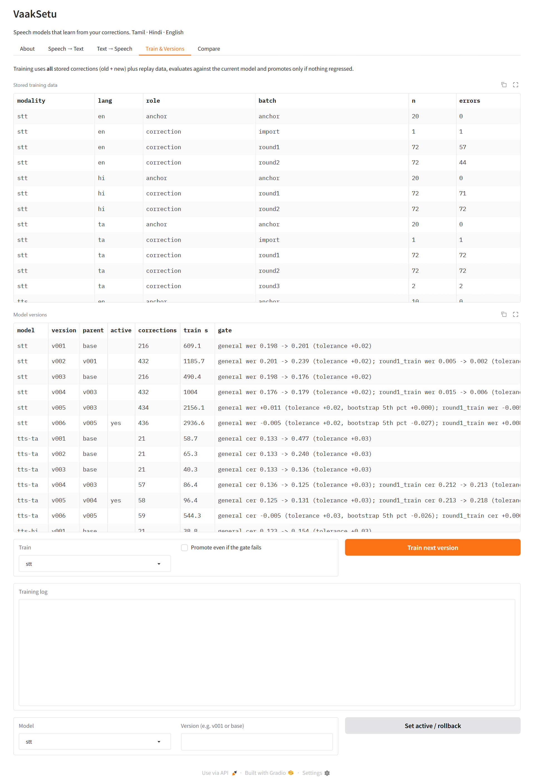
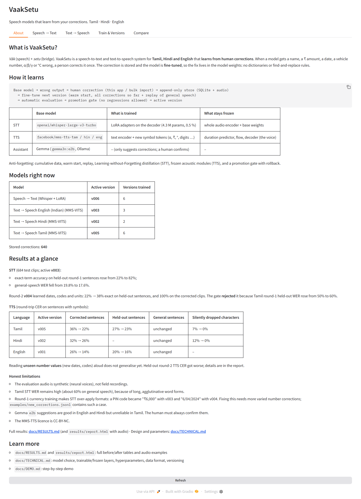

# VaakSetu

[](https://github.com/Sandeepsrinivasan-14/VaakSetu/actions/workflows/ci.yml)


<p align="center"><b>Speech models that learn from human corrections: Tamil · Hindi · English</b></p>

<p align="center">
<a href="#the-app">The app</a> ·
<a href="#results-at-a-glance">Results</a> ·
<a href="#quick-start">Quick start</a> ·
<a href="#the-loop">How it learns</a> ·
<a href="docs/TECHNICAL.md">Technical design</a> ·
<a href="CONTRIBUTING.md">Contributing</a>
</p>

<p align="center"></p>

VaakSetu is a speech-to-text (STT) and text-to-speech (TTS) system built on open, fine-tunable models. When a model gets something wrong (a name, a ₹ amount, a date, a vehicle number, α/β/γ, °C), a person corrects it once. The correction becomes training data and the model is fine-tuned, so the fix lives **in the model weights**. There are no dictionaries or find-and-replace rules at runtime.

| | Base model | How it learns |
|---|---|---|
| STT | Whisper large-v3-turbo | LoRA adapters on the decoder; the encoder is frozen |
| TTS | MMS-TTS (VITS) for ta / hi / en | text encoder trained; duration and voice modules are frozen; new symbols become learnable tokens |
| Assistant | Gemma (`gemma3n:e2b` via Ollama) | suggests corrections; the human confirms them |

## The app

A Gradio web app (`python app/app.py`) is the human-in-the-loop interface: listen, correct, train, compare.

### Speech → Text
Upload or record speech, transcribe it with any model version, then fix the transcript by hand or ask Gemma for a suggestion. *Save correction* stores the audio and the corrected text as training data.



### Text → Speech
Type text, listen to the model, and if a number, date or symbol is mispronounced, write (or let Gemma suggest) how it should be read. *Preview target* lets you hear the intended pronunciation before saving.



### Train & Versions
Every stored correction, every trained version, and the promotion-gate result that decided whether it went live. Train the next version, or roll back to any earlier one, with one click.



### Compare
Run the same audio or text through two versions side by side. Above, the base model writes Devanagari gibberish for a Tamil clip while the fine-tuned version transcribes it correctly.


### About
Live overview of the active model versions and the headline results.



## Results at a glance

**STT** (684 test clips; evaluated **v003**):
- exact-term accuracy on held-out round-1 sentences rose from 22% to 82%;
- general-speech WER fell from 19.8% to 17.6%.

Round-2 **v004** learned dates, codes and units: 22% → 38% exact on held-out sentences, and 100% on the corrected clips. The gate **rejected** it because Tamil round-1 held-out WER rose from 50% to 60%.

**TTS** (round-trip CER on sentences with symbols):

| Language | Evaluated version | Corrected sentences | Held-out sentences | General sentences | Silently dropped characters |
|---|---|---|---|---|---|
| Tamil | v005 | 36% → 22% | 27% → 23% | unchanged | 7% → 0% |
| Hindi | v002 | 32% → 26% | – | unchanged | 12% → 0% |
| English | v001 | 26% → 14% | 20% → 16% | unchanged | – |

Reading **unseen number values** (new dates, codes) aloud does not generalise yet. Held-out round-2 TTS CER got worse; details are in the report.

**Honest limitations**
- The evaluation audio is synthetic (neural voices), not field recordings.
- Tamil STT WER remains high (about 60% on general speech), because of long, agglutinative word forms.
- Round-1 currency training makes STT over-apply formats: a PIN code became "₹6,000" with v003 and "6/04/2024" with v004. Fixing this needs more varied number corrections; `examples/new_corrections.jsonl` contains such a case.
- Gemma `e2b` suggestions are good in English and Hindi but unreliable in Tamil. The human must always confirm them.
- The MMS-TTS licence is CC-BY-NC.

Full results: **[docs/RESULTS.md](docs/RESULTS.md)** (and `results/report.html` with audio) ·
Design and parameters: **[docs/TECHNICAL.md](docs/TECHNICAL.md)**

## Quick start

```bash
pip install -r requirements.txt           # CUDA build of torch recommended
python scripts/build_seed_audio.py        # 744 demo recordings (needs internet once)
python scripts/run_pipeline.py            # full demo: baseline → 2 correction rounds → retest
python scripts/make_report.py             # docs/RESULTS.md + results/report.html
python app/app.py                         # correction UI at http://127.0.0.1:7860
```

The app loads all models at start-up (about 25 s) so the first click is fast, and runs the Gemma assistant on the CPU so it never competes with Whisper/VITS for GPU memory (see [CONTRIBUTING.md](CONTRIBUTING.md) for the environment variables). Trained weights and audio are not stored in git; regenerate them with the pipeline above.

Hardware used: RTX 3050 Laptop (4 GB), 16 GB RAM, Windows 11. STT training peaks at about 3.5 GB of GPU memory and TTS training at about 0.5 GB.

## The loop

```
Base model → wrong output → human correction (app / import) → data/vaaksetu.db (append-only)
  → python scripts/train.py stt | tts --lang ta  → models/<…>/v00N  (warm-started, cumulative data + replay)
  → automatic evaluation vs. current model → promotion gate → active version → better output
```

## Continue training with new corrections

```bash
python app/app.py                              # correct outputs in the browser, then "Train next version"
python scripts/train.py import fixes.jsonl     # …or bulk import
python scripts/train.py stt                    # new STT version (evaluated + gated)
python scripts/train.py tts --lang hi          # new Hindi TTS version
python scripts/train.py status | rollback stt v001 | export
python scripts/train.py augment-numbers --n 30 # synthetic English currency pairs for number generalisation
```

## Use a trained model elsewhere

```bash
python scripts/load_demo.py stt models/stt/v003 clip.wav --lang ta --device cpu
python scripts/load_demo.py tts models/tts/ta/v005 "டிக்கெட் விலை ₹500." out.wav --device cpu
```

`load_demo.py` doesn't import any project code; it only needs `transformers`, `peft` and `soundfile`.

## Layout

```
vaaksetu/        library: config, audio, text, data/store, registry, learning loop,
                 stt/{engine,train}, tts/{engine,train,vocab,tokenization_vaaksetu}, eval/, assist/gemma
scripts/         build_seed_audio · run_pipeline · train (CLI) · make_report · load_demo
app/app.py       Gradio UI
configs/         stt.yaml, tts.yaml (all hyper-parameters)
data/            vaaksetu.db, audio/ (content-addressed), snapshots/, exports/, seed/
models/          registry.json + versioned adapters/checkpoints
results/         pipeline outputs, audio samples, report.html
tests/           pytest suite (store immutability, registry, MAS, vocab extension, …)
```
